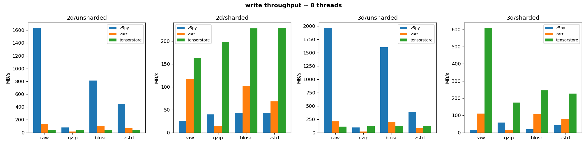
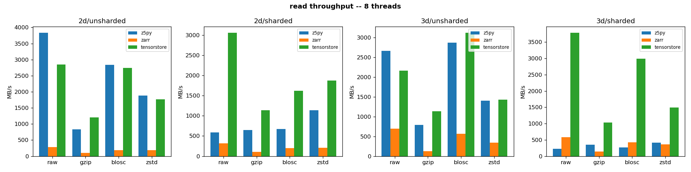

# Benchmarks

- **bench-python**: cross-library zarr **v3** read/write benchmark — z5py vs
  [zarr-python](https://github.com/zarr-developers/zarr-python) (>= 3) vs
  [tensorstore](https://github.com/google/tensorstore), with and without sharding.
- **bench-java**: re-implementation of the
  [n5-java benchmarks](https://github.com/saalfeldlab/n5/blob/master/src/test/java/org/janelia/saalfeldlab/n5/N5Benchmark.java).

There is also a [repository with an asv benchmark suite](https://github.com/constantinpape/z5py-benchmarks)
to track z5 performance over time; results are hosted
[here](https://constantinpape.github.io/z5py-benchmarks/).

## bench-python

`bench_python/bench_zarr_v3.py` benchmarks z5's zarr v3 implementation against
zarr-python and tensorstore for 2D and 3D data, across the codecs common to all three
(`raw` / `gzip` / `blosc` / `zstd`), reading and writing.

Two threading scenarios are measured for every configuration:

- **single-threaded** — every library pinned to one worker. The *fair* comparison: pure
  codec + IO speed, no parallelism.
- **multi-threaded** — every library given `N` workers (`N` defaults to the CPU count).
  z5's C++ chunk-level threadpool tends to win here; all three libraries still get `N`
  workers, so the comparison is honest, just favourable to z5.

The threading knobs used: z5py `n_threads`, zarr-python
`zarr.config(threading.max_workers, async.concurrency)`, tensorstore
`data_copy_concurrency` / `file_io_concurrency`.

Codec levels are pinned identically across libraries (gzip level 5, zstd level 3, blosc
lz4 clevel 5 with byte shuffle), so the comparison is apples-to-apples. Reads are
warm-cache (decode/copy bound): each store is written once, then read back several times.
Each measurement round-trips and asserts equality, so a broken codec can't post a fast
(but wrong) number.

Data is semi-compressible synthetic data (smooth gradient + mild noise) by default so the
codecs do real work; pass `--random` for the incompressible worst case.

### Running

Requires the conda dev env (`environments/unix/z5-dev.yaml`), which provides `zarr >= 3`,
`tensorstore`, `matplotlib`, `pandas` and (optionally) `seaborn`. Run from `bld/python`
(where `make` copies `z5py`) or after `make install`.

```bash
# full default run (2D + 3D, all codecs, single- and multi-threaded); reproduces the
# checked-in reference artifacts under results/
python bench_zarr_v3.py --out results/bench_v3_results.json
python plot_results.py --results results/bench_v3_results.json --out-dir results

# quick smoke run
python bench_zarr_v3.py --dims 2d --codecs raw gzip --iterations 1 --warmup 0 --threads 2
```

Useful flags: `--libraries`, `--dims {2d,3d}`, `--codecs`, `--threads N`,
`--iterations`, `--warmup`, `--dtype`, `--random`, `--save-folder`, `--keep`, `--out`.
Libraries that aren't importable (and sharding on a z5 build without it) are skipped with
a warning, so the benchmark still runs with a subset installed.

### Output

`bench_zarr_v3.py` writes a JSON file (`{"meta": ..., "records": [...]}`) — one record per
`(library, dim, sharded, codec, threads, op)` with all per-iteration times, `min`/`median`,
throughput in MB/s, on-disk size and compression ratio — and prints a console summary
table. `plot_results.py` turns that JSON into throughput bar charts (one per
operation/thread-mode, faceted by dim × sharding) and a compression-ratio chart.

### Results

A full reference run is checked in under [`bench_python/results/`](bench_python/results)
(`bench_v3_results.json` plus the generated plots). It was measured on an 8-core Linux box
with z5py 2.1.2, zarr-python 3.1.3, tensorstore, numpy 1.26.4; `uint8` semi-compressible
data (2D = 8192², 3D = 256×512×512, ≈64 MB each); best-of-3 iterations.

Throughput in **MB/s**, higher is better.

**Headline**

- **Unsharded zarr v3 — z5 wins, and the multi-threaded lead is large.** z5's C++
  chunk-level threadpool scales nearly linearly with thread count; zarr-python and
  tensorstore writes barely scale.
- **Sharded zarr v3 — z5 is currently the weakest of the three on writes**, which do *not*
  scale with threads (and sometimes regress). tensorstore is the sharding champion.
- **Compression ratios match across all three libraries** (raw 1.00, gzip 1.84–1.98,
  zstd 1.81–2.12, blosc 1.00–1.14) — confirming the codec settings were genuinely
  apples-to-apples (this is also the `compression_ratio.png` sanity plot).

**Unsharded (z5's strong suit)**

| measurement | z5py | zarr | tensorstore |
|---|---:|---:|---:|
| 2D raw write, 8 threads | **1635** | 135 | 38 |
| 2D raw read, 8 threads  | **3829** | 280 | 2849 |
| 3D raw write, 8 threads | **1964** | 210 | 110 |
| 3D blosc read, 8 threads | 2867 | 564 | **3116** |

z5 leads every unsharded write at 8 threads and most reads; threading multiplies z5's
write throughput ~2.4–4× while the others gain little.



**Sharded (z5's weak spot)**

| measurement | z5py | zarr | tensorstore |
|---|---:|---:|---:|
| 2D raw write, 8 threads | 25 | 118 | **163** |
| 3D raw write, 8 threads | 13 | 111 | **609** |
| 3D raw read, 8 threads  | 227 | 584 | **3782** |

z5's sharded raw write at 8 threads is *slower* than at 1 thread (3D: 12.7 → 12.8; 2D:
67 → 25): the per-shard read-modify-write under a single mutex serializes writes, so extra
threads only add contention. tensorstore's sharded writes scale to 600+ MB/s.



**Codec notes**

- `gzip` is z5's softest codec — tensorstore is competitive or better on gzip even
  unsharded (it beats z5 on gzip *read*). z5's v3 gzip is the zlib-with-gzip-wrapper path.
- `blosc`/`zstd`: z5 is excellent unsharded; on this `uint8` gradient `blosc` (lz4) barely
  compresses (ratio ≈ 1.0–1.14), so it is mostly a speed contest, which z5 wins unsharded.

**Takeaway:** unsharded multi-threaded is where z5 shines, often by an order of magnitude
over zarr-python and ahead of tensorstore. The clear optimization target is the
**sharded-write path**, whose per-shard mutex caps throughput well below tensorstore and
prevents it from scaling with threads.
